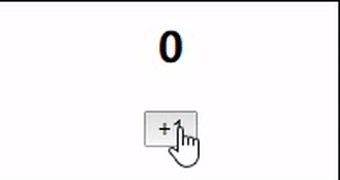

# mini-vue
从零开始，一步一步实现vue。和网络上其他的源码解析不同，我们换一个角度，用我们最熟悉最简单的方式，一步一步推演vue框架的诞生。

对于大多数人来说，一上来看源码，一点用处也没有。照着源码敲，也无法真正领悟其中的精髓，无法学以致用。只有自己亲自上手，才会发现差距。

因此，我创建了这个仓库，以最原始的方式慢慢推演出Vue。每个版本对应一个分支，从v0.0.1开始，每个版本对应一个小功能。

PS：在编码过程中，为了更清晰的了解逻辑，会省略一些数据校验，我们都假设为正确的数据。（不必细究）


## Vue功能点
- 模板解析，生成数据对象与render函数
- 数据响应式 （监听器与依赖收集）
- 执行render生成虚拟DOM，diff算法更新虚拟DOM
- v-model,v-for,v-if,v-show...等指令
- 自定义指令
- mixin
- props,computed
- 生命周期钩子
- 事件管理机制


## 安装、启动
```bash
pnpm i
```

```bash
npm run dev
```
## 简单应用场景
一个按钮，一个数字，不断点击按钮，数字对应的变化


## v0.0.1
简单的单文件vue.js 通过Object.defineProperty 改变dom

## v0.0.2
模块化改造，将单个vue文件拆解成多个文件。
重点探究vue的响应式依赖收集原理，其他的功能就简化了

### 难点
1. app.js 组件对象抽离，render函数需要重新设计
2. abserver.js 响应式逻辑抽离，需要考虑依赖收集与更新的操作时机。
3. dep 与 watcher 之间的多对多关系映射，以及对Dep.target对象的理解

## v0.0.3
实现虚拟DOM渲染

重点探究子节点更新的diff算法，以及DOM更新渲染的判断逻辑
  - 新旧数组，分别使用双指针进行遍历
  - 判断顺序：旧前-新前, 旧后-新后, 旧前-新后, 旧后-新前, 新前依次查找匹配（优先使用key匹配）
  - 重点关注每个vnode的el属性，确保el不遗失